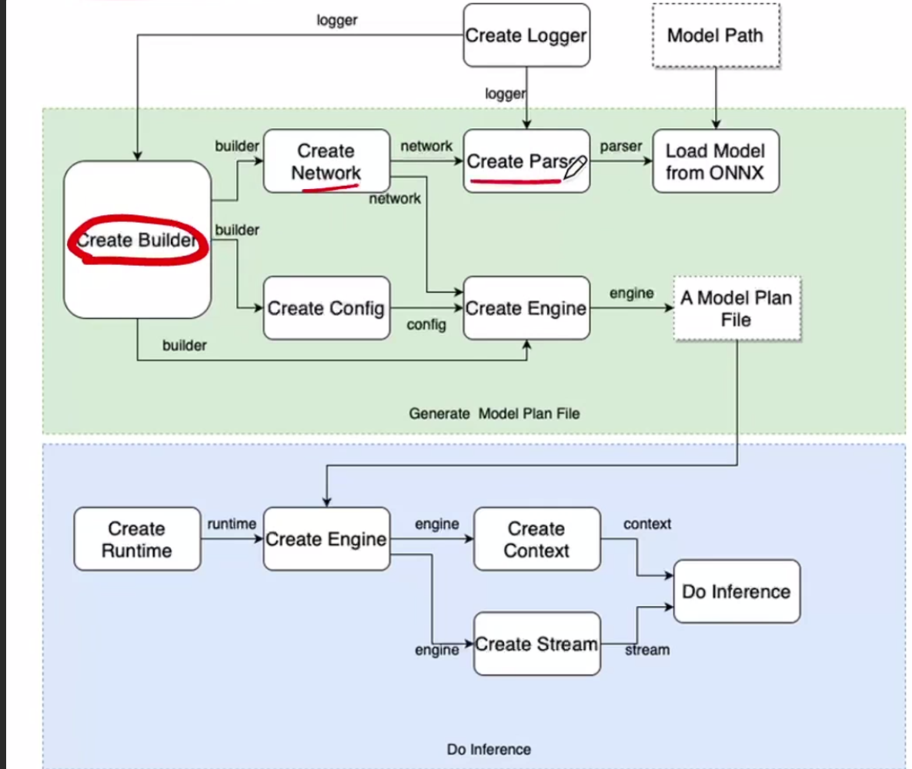

# StableDiffusionEO

StableDiffusionEO项目源自[shenlan2017/TensorRT-StableDiffusion: The Project of the Model Deployment course on ShenLan College](https://github.com/shenlan2017/TensorRT-StableDiffusion)项目的export_onnx分支


## 项目配置
```python
pip install -r requirements.txt
```
或者使用docker
```python
docker pull shenlan2017/tensorrt-stable-diffusion:latest
```


## 本项目实现的内容

- [x] 案例：CNSD模型的torch-onnx-trt模型转换以及trt模型调用

  - [x] 将CNSD模型的四个模型从torch模型转换为onnx模型；（**含检测torch和onnx模型输出差异的方法**）；

    export_onnx_all.py

  - [x] 将CNSD模型的四个模型从onnx模型转换成trt模型；

    onnx2trt_static.py

  - [x] CNSD模型基于pytorch源码进行运行。

    当cldm文件夹复制为cldm_torch文件夹，ldm文件夹复制为ldm_torch文件夹时，项目从compute_score.py作为入口，将基于pytorch模型进行运行；

  - [x] CNSD模型基于trt模型进行运行。

    当cldm文件夹复制为cldm_trt文件夹，ldm文件夹复制为ldm_trt文件夹时，项目从compute_score.py作为入口，将基于trt模型进行运行；

- [x] 案例：YOLOV5模型的torch-onnx-trt模型转换以及trt模型调用

  - [x] ~~将模型的四个模型从torch模型转换为onnx模型~~；

    practice_yolov5\export_onnx_yolov5.py 

    （鉴于本项目不包含yolov5源码，暂舍去该实现，📕**不过需要注意onnx生成时的inputname和outputname**）

  - [x] 将YOLOV5模型的四个模型从onnx模型转换成trt模型

    practice_yolov5\onnx2trt_static_yolov5.py

  - [x] 检测onnx和trt模型输出差异的方法。

    practice_yolov5\trt_yolov5.py

    - **含trt模型和onnx模型初始化方法；**
    - **含trt模型和onnx模型调用方法；**
    - 含数据预处理操作；（PreProcessor）
    - 含数据后处理操作；（PostProcessor）
    - 含检测onnx和trt模型输出差异的方法；（check_onnx_trt_outputs）


## 作业需要注意的内容
### 第五章--第一次作业


### 第七章--第二次作业


### 第八章--第三次作业
内容：合并CrossAttention的qkv层
注意：qkv层修改之后，在转换成onnx时，onnx_check函数会报与torch模型输出不一致的错误，是因为self.qkv_w和self.kv_w并没有出现在CNSD的持久化参数文件中，因此
各个attention层中的q、k、v在模型初始化后，会经过持久化模型的修改；
而其中的self.qkv_w和self.kv_w是在模型初始化后，由于之前的持久化模型中并不包含该参数，因此不会对该参数进行重写。    

## 知识点汇总

### CNSD模型结构


### ONNX模型初始化和调用方法

```python
# onnx模型初始化
input_dicts = {"images":image_tensor.numpy()}
sess = rt.InferenceSession(onnx_path) 
# onnx模型调用
outputs_onnx = sess.run(None, input_dicts)[0]             
```


### TRT模型转换

```python
def onnx2trt(onnxFile, plan_name, min_shapes, opt_shapes, max_shapes, max_workspace_size = None, use_fp16=False, builder_opt_evel=None):
    logger = trt.Logger(trt.Logger.VERBOSE)                                                         # create logger
    builder = trt.Builder(logger)                                                                   # create builder
    config = builder.create_builder_config()                                                        # create config
    network = builder.create_network(1<<int(trt.NetworkDefinitionCreationFlag.EXPLICIT_BATCH))      # create network
    
    if max_workspace_size:                                                                          # init config
        config.max_workspace_size = max_workspace_size
    else:
        config.max_workspace_size = 10<<30 # 10GB

    parser = trt.OnnxParser(network, logger)                                                         # create parser
    if not os.path.exists(onnxFile):
        print("Failed finding onnx file!")
        exit()
    print("Succeeded finding onnx file!")
    with open(onnxFile, 'rb') as model:
        # import pdb; pdb.set_trace()
        (onnx_path, _) = os.path.split(onnxFile)
        if not parser.parse(model.read(), path=onnxFile):                                            # parse onnx
            print("Failed parsing ONNX file!")
            for error in range(parser.num_errors):
                print(parser.get_error(error))
            exit()
    print("Succeeded parsing ONNX file!")

    if use_fp16:                                                                                      # init config
        config.set_flag(trt.BuilderFlag.FP16)
        plan_name = plan_name.replace(".plan", "_fp16.plan")

    if builder_opt_evel:
        config.builder_optimization_level = builder_opt_evel

    # set profile
    assert network.num_inputs == len(min_shapes)
    assert network.num_inputs == len(opt_shapes)
    assert network.num_inputs == len(max_shapes)

    profile = builder.create_optimization_profile()                                                   # create profile
    for i in range(network.num_inputs):                                                               # set profile
        input_tensor = network.get_input(i)
        profile.set_shape(input_tensor.name, tuple(min_shapes[i]), tuple(opt_shapes[i]), tuple(max_shapes[i]))

    config.add_optimization_profile(profile)                                                          # init config

    engine = builder.build_engine(network, config)                                                    # create engine
    if not engine:
        raise RuntimeError("build_engine failed")
    print("Succeeded building engine!")

    print("Serializing Engine...")
    serialized_engine = engine.serialize()                                                             # serialize engine
    if serialized_engine is None:
        raise RuntimeError("serialize failed")

    (plan_path, _) = os.path.split(plan_name)
    os.makedirs(plan_path, exist_ok=True)
    with open(plan_name, "wb") as fout:
        fout.write(serialized_engine)
```


### TRT模型初始化和调用方法

```python
# trt模型初始化
clip_engine = engine_from_bytes(bytes_from_path(engine_path))
model_feed_dict = {
            'images': (1, 3, 1120, 1120),
            'output0': (1, 77175, 14)
        }
context = clip_engine.create_execution_context()
clip_engine.allocate_buffers(model_feed_dict)
clip_engine.get_engine_infor()
# trt模型调用
outputs_trt = clip_engine.infer({"images":image_tensor})[onnx_names["output"]].cpu().detach().numpy()
"""
noerror = self.context.execute_async_v3(0)
"""
```




```python

class Engine():
    def __init__(
        self,
        engine_path,
    ):
        self.engine_path = engine_path
        self.engine = None
        self.context = None
        self.buffers = OrderedDict()
        self.tensors = OrderedDict()
        self.latent_h = 1120
        self.latent_w = 1120
        self.batch_size = 1
        self.cuda_graph_instance = None # cuda graph
        
    def yolov5_model_shape_dict(self):
        return {
            'images': (self.batch_size, 3, self.latent_h, self.latent_w),
            'output0': (self.batch_size, 77175, 14)
        }
    def __del__(self):
        [buf.free() for buf in self.buffers.values() if isinstance(buf, cuda.DeviceArray) ]
        del self.engine
        del self.context
        del self.buffers
        del self.tensors

    def load(self):
        print(f"Loading TensorRT engine: {self.engine_path}")
        self.engine = engine_from_bytes(bytes_from_path(self.engine_path))

    def activate(self, reuse_device_memory=None):
        """激活TensorRT引擎的执行上下文。
        """
        # 如果提供了 reuse_device_memory，则创建一个没有分配新设备内存的执行上下文，并将其设置为当前上下文
        if reuse_device_memory:
            self.context = self.engine.create_execution_context_without_device_memory()
            self.context.device_memory = reuse_device_memory
        else:  # 如果没有提供 reuse_device_memory，则创建一个新的执行上下文
            self.context = self.engine.create_execution_context()

    def allocate_buffers(self, shape_dict=None, device='cuda'):
        """为 TensorRT 引擎分配输入和输出缓冲区。
        """
        # 遍历每个绑定（输入或输出）
        for idx in range(trt_util.get_bindings_per_profile(self.engine)):
            binding = self.engine[idx]                 # 获取绑定的名称
            if shape_dict and binding in shape_dict:   # 如果提供了 shape_dict 并且绑定在 shape_dict 中，则使用 shape_dict 中的形状
                shape = shape_dict[binding]
            else:
                shape = self.engine.get_binding_shape(binding)         # 否则，使用引擎的默认形状
            dtype = trt.nptype(self.engine.get_binding_dtype(binding)) # 获取绑定的数据类型
            if self.engine.binding_is_input(binding):        # 如果绑定是输入，则设置上下文的绑定形状
                self.context.set_binding_shape(idx, shape)
            tensor = torch.empty(tuple(shape), dtype=numpy_to_torch_dtype_dict[dtype]).to(device=device)
            self.tensors[binding] = tensor                   # 将张量添加到 tensors 字典中，键为绑定的名称
            
    def get_engine_infor(self):
        # 计算输入张量的数量
        nInput = np.sum([self.engine.binding_is_input(i) for i in range(self.engine.num_bindings)])
        # 计算输出张量的数量
        nOutput = self.engine.num_bindings - nInput
        # 获取输入张量的名称和形状
        input_infor = dict((self.engine.get_tensor_name(i), self.context.get_binding_shape(i))  for i in range(nInput))
        # 获取输出张量的名称和形状
        ouput_infor = dict((self.engine.get_tensor_name(nInput + i), self.context.get_binding_shape(nInput + i))  for i in range(nOutput))
        print("TensorRT engine infors -----------------")
        print("engin nInput: ", nInput, ", Input shape: ", input_infor)
        print("engin nOutput: ", nOutput, ", Outpu shape: ", ouput_infor)

    def infer(self, feed_dict, stream=None, use_cuda_graph=False):
        # import pdb; pdb.set_trace()
        # 遍历 feed_dict 中的每个键值对，将值复制到对应的张量中
        for name, buf in feed_dict.items():
            self.tensors[name].copy_(buf)

        # 遍历 tensors 中的每个键值对，设置张量的地址
        for name, tensor in self.tensors.items():
            self.context.set_tensor_address(name, tensor.data_ptr())

        # 如果使用 CUDA 图优化
        if use_cuda_graph:
            
            if self.cuda_graph_instance is not None:  # 如果已经有一个 CUDA 图实例
                CUASSERT(cudart.cudaGraphLaunch(self.cuda_graph_instance, stream.ptr))  # 启动 CUDA 图实例
                CUASSERT(cudart.cudaStreamSynchronize(stream.ptr))                      # 同步 CUDA 流
            else:                                     # 如果没有 CUDA 图实例
                # do inference before CUDA graph capture
                noerror = self.context.execute_async_v3(stream.ptr)
                if not noerror: raise ValueError(f"ERROR: inference failed.")   # 如果推理失败，抛出异常
                # capture cuda graph
                CUASSERT(cudart.cudaStreamBeginCapture(stream.ptr, cudart.cudaStreamCaptureMode.cudaStreamCaptureModeGlobal))                # 开始捕获 CUDA 流
                self.context.execute_async_v3(stream.ptr)    # 执行推理
                self.graph = CUASSERT(cudart.cudaStreamEndCapture(stream.ptr))   # 结束捕获 CUDA 流
                self.cuda_graph_instance = CUASSERT(cudart.cudaGraphInstantiate(self.graph, 0))  # 实例化 CUDA 图
        else:
            if stream:
                noerror = self.context.execute_async_v3(stream.ptr)
            else:
                noerror = self.context.execute_async_v3(0)
            if not noerror:
                raise ValueError(f"ERROR: inference failed.")

        return self.tensors
```


### 检测模型转换前后输出差异

```python
## 以yolo为例
# 1 模型输出 [bs, anchors_number, 5 + nc]
ret = np.allclose(model_trt_outputs, model_onnx_outputs, rtol=1e-03, atol=1e-05, equal_nan=False)
# 2 最终任务的输出结果 [bs, achors_number, 6]
# 3 polygraph输出onnx和trt模型的每层输出（排查nan溢出时）
# 4 
```


### FP16优化的理论与实现方式


### buildoptimal的理论与实现方式


### cuda图优化的理论与实现方式


### pipeline优化的方面：迭代次数、拼batch、模型内部优化


### int8量化


### 深度优化


## TODO

- [ ] cuda和trt的语法体系比较欠缺；

- [ ] YOLOV5模型结构

- [ ] FP16优化的理论与实现方式；

  

- [ ] cuda图优化的理论与实现方式；

- [ ] buildoptimal的理论与实现方式；

- [ ] pipeline优化的方面：迭代次数、拼batch、模型内部优化；

- [ ] int8量化；

- [ ] int4量化；

- [ ] 深度优化

- [ ] 剪枝；

- [ ] 蒸馏；

- [ ] 拼batch
